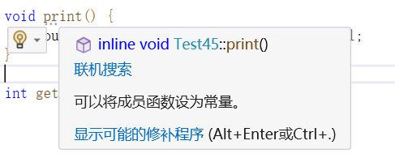

## 11.1 类和面向对象编程

### 简述

- 面向对象编程(OOP)的本质：根据要解决的问题范围内所涉及的对象来编写程序，因此在开发过程中的一部分是设计一组类型来满足要求。
- 类可以组合其他类型的变量，也可以把函数作为其定义的部分。
- 面向对象编程的重要理念：封装和数据隐藏、继承、多态

### 案例：封装和数据隐藏

```C++
class Box{
private:
	double height;
	double length;
	double width;
public:
	double getVolume();
	double getSurfaceArea();
    double setHeight(double h);// 设置高度，可以调用checkValue，来检查h是否合法。
        
private:
    bool checkValue();
    
}
```

- 每个对象都含有一组数据值，类的成员变量；一组操作，作为类的成员函数。将这些成员变量和成员函数打包到一个对象，就叫做封装。
- 数据隐藏：即通过可控的方式来访问对象的数据。即通过 **对象.属性** 来设置对象属性，可能出现值不符合实际情况的赋值。如将Box对象的高设置为负数。而通过 **对象.函数** 来设置对象属性，可以在函数中进行相关操作，以保证数据的输入为合法后才进行修改。

### 案例：继承

```C++
class Animal{// 爬行动物类
private:
	int number_feet;
	string name;
    vector<string> like_food;
    
public:
    void eat();
    void walk();
};

class Perple : public Animal{// 不用再反复声明成员变量，如number_feet
public:
    void eat(){
        
    }
    
    void walk(){
        cout << "双脚走\n";
    }
    
};
class Dog : public Animal{
public:
    void eat(){
        
    }
    
    void walk(){
        cout << "四脚走\n";
    }
};
```

- 继承是根据一个类来定义另一个类。
- B类继承A类，A类被称为基类，B类被称为派生类。
- 派生类继承了基类的成员变量和成员函数，同时派生类可以声明自己的成员变量和成员函数。
- 派生类还可以覆盖基类的函数，改行为被称为重写。
- 如果一个类派生了多个类，那么该类可被称为公共类。
- 类定义：class 类名{ 成员变量和成员函数 };


### 案例：多态性

```C++
class Animal{// 爬行动物类
private:
	int number_feet;
	string name;
    vector<string> like_food;
    
public:
    virtual void eat(){

    }
    virtual void walk(){
        cout << "动物走\n";
    }
};

class People : public Animal{// 不用再反复声明成员变量，如number_feet
public:
    void eat(){
        
    }
    
    void walk(){
        cout << "双脚走\n";
    }
    
};
class Dog : public Animal{
public:
    void eat(){
        
    }
    
    void walk(){
        cout << "四脚走\n";
    }
};
void animal_move(Animal* obj){
    obj->walk();
}
void test1(){
    People p;
    Dog d;
    animal_move(&p);
    animal_move(&d);
}

// 结果
双脚走
四脚走
```

- 多态性表示同一对象在不同的时刻具有不同的形态。
- C++的多态性总是设计指针或引用来调用对象的成员函数。
- 多态的条件：一个基类和它的多个派生类，基类声明了虚函数，且派生类进行了重写。


## 11.3 定义类

### 案例

```C++
class ClassName{

	int private_m1;
	void private_f1(){};

// 一些public修饰的成员
public:
	int a;
	int b;
	
	void fun1(){}
	
// 一些private修饰的成员
priate:
	int c;
	int d;
	
	void f2(){};
};
```

- 使用关键字class来定义类，其后紧跟类名。类名通常采用驼峰命名法，且首字母为大写。
- 类名后使用{}，在{}中定义自己的成员。不要忘了{}需要加；作为结束。
- 如果没有使用访问修饰符修饰，则默认为private，如前两个成员。通常最好显式指出访问修饰符。
- 访问修饰符有：private 、 protected、 public。
- 使用访问修饰符:（public:），直到遇到下一个访问修饰符，其后续成员即都是public。
- C++中沿用了C的结构体关键字struct，其余class的唯一区别就是，结构体中不指定访问修饰符，默认为public修饰成员。通常将只含有成员变量的类使用结构体定义。


## 11.4 构造函数

### 案例1：默认构造函数和定义类的构造函数

```C++
class A{
public:
    int a;
    int* pa;  
};
class B{
public:
    int a;
    int* pa;  
    B(){
        a = 0;
        pa = nullptr;
    }
    B(int _a){
        a = _a;
    }
    B(int* _pa) : pa(_pa){}
};
void test2(){
    A a;
    
    cout << a.a << endl;
    cout << "指针默认值：" << a.pa << endl;

    B b;
    cout << b.a << endl;
    cout << "指针默认值：" << b.pa << endl;

    B b1{3};
    cout << b1.a << endl;

    B b2{&b1.a};
    cout << *b2.pa << endl;

}
// 结果
8
指针默认值：0x2d
0
指针默认值：0
3
3
```

- 构造函数的作用：创建新对象时初始化对象的成员变量，以确保成员变量为有效值。
- 构造函数的名称和类名相同，且构造函数不需要返回值。
- 如果没有给定类任何构造函数，则编译器会提供默认的默认构造函数。
- 对于为指针的成员变量，编译器提供的默认构造函数不够健康。


### 案例2：使用default关键字

```C++
class Default{
public:
    int m_a{0};
    int* m_p{nullptr};

    Default() = default;
    Default(int a, int* p): m_a(a), m_p(p){}

};

void test3(){
    Default d1;
    cout << d1.m_a << " " << d1.m_p << endl;

    Default d2{1,nullptr};
    cout << d2.m_a << " " << d2.m_p << endl;
}
// 结果
0 0
1 0
```

- 如果默认(无参)构造函数体中无操作，推荐优先使用default关键字


### 案例3：在类的外部定义函数和构造函数

```c++
// Test45.h
#include <iostream>
using std::cout;
using std::endl;

class Test45 {
public:
    int a{ 0 };
    int* p{ nullptr };

    Test45() = default;
    Test45(int _a, int* _p);
    Test45(int _a);

    void print() {
        cout << "a: " << a << " p: " << p << endl;
    }
};

// Test45.cpp
#include "Test45.h"
Test45::Test45(int _a, int* _p) {
    a = _a;
    p = _p;
}

Test45::Test45(int _a) : a(_a){}

// 测试
// 在类的外部定义函数
void MyTest::test1(){
	Test45 t1;
	t1.print();
	Test45 t2{1};
	t2.print();
	Test45 t3{2,&t2.a};
	t3.print();
}

// 结果
a: 0 p: 0000000000000000
a: 1 p: 0000000000000000
a: 2 p: 00000092B60FF778
```

- 对于类的成员函数，常见的做法是在.h头文件中声明类的成员函数，在.cpp源文件中定义类的成员函数。
- .cpp源文件中需要包含类定义的.h头文件。
- 对于类中要用的头文件如<iostream>,一般将函数定义和头文件转移至该类的.cpp源文件中，避免他人在include你的类的头文件后导入不想要的头文件。会发生的坏例子：某人导入了一个类的头文件中包含using namespace std;，但使用该类的人创建了一个和std下同名的函数。
- 在.cpp源文件中使用 <返回类型> <类名> <::> <函数名> <参数列表> <{函数体}> 来进行定义，其中如果返回类型为void，则定义时可以省略。解释：.h头文件可以有多个类，每个类可以有相同的函数名。所以通过类名和函数名可以唯一确定哪个类中的函数。
- 当类的成员函数在类中定义，编译器会自己判断是否将其作为内联函数。
- 

### 案例4：默认构造函数的参数值

```c++
class Test45 {
public:
    int m_a{ 0 };
    int* p{ nullptr };
    int m_b{ 0 };
    int m_c{ 0 };

    Test45() = default;
    Test45(int _a, int* _p);
    //Test45(int b = 1, int c = 1);// 如果不传入任何函数，该重载即为默认构造函数，因此当前无法编译通过
    Test45(int a, int b = 1, int c = 1) {
        m_a = a;
        m_b = b;
        m_c = c;
    }
};

```

- 当调用时，不传默认参数，如果和某个构造函数的签名相同时，无法编译成功。


### 案例5：使用成员初始化列表

```C++
	Test45(int a, int b) : m_a(a), m_b(b) {}

	Test45(int a, int b) : m_a{ a }, m_b{ b } {}
```

- 在参数列表后使用 <:> 隔开，后续就是每个变量的初始化。他们之间用<,>逗号隔开。需要注意的是既可以使用()也可以使用{}用于初始化。但()对于自定义类型来说，会出现拷贝构造函数的调用。使用{}更高效。
- 使用的好处：不使用时，首先创建对象，创建对象的时候会创建成员变量，然后进行赋值操作。使用后，在创建成员变量时就将用该值进行初始化。相对于赋值操作，要高效。
- 当前未学到的知识点：有些成员变量只能使用该方式进行赋值。
- 成员变量初始化是按照其声明的顺序，不是按照函数中成员初始化列表的顺序。因此赋值需要复杂的逻辑或初始化顺序很重要，建议在函数体中进行。


### 案例6：使用explicit关键字

```C++
class Cube {
public:
    int m_side;

    Cube() = default;
    Cube(int side) : m_side{ side } {};

    int getV() {
        return pow(m_side, 3);
    }

    /*bool isLargerThan(Cube& c) { // 接受引用，
        return getV() > c.getV();
    }*/

    bool isLargerThan(Cube c) {// 如果构造函数只有一个参数，则会将该参数用来进行构造对象。即隐式转换
        return getV() > c.getV();
    }
    
    /*bool isLargerThan(const Cube& c) {// const对象只能调用const成员函数

         return getV() > c.getV();
    }*/
};

//使用explicit，只能显式转换
void MyTest::test2(){
	Cube c1{ 5 };
	Cube c2{ 2 };
	cout << "传参为对象" << endl;
	cout << c1.isLargerThan(c2) << endl;

	cout << "传参为int类型的值" << endl;
	cout << c1.isLargerThan(50) << endl;
}

// 结果
传参为对象
1
传参为int类型的值
0
    
class ExplicitCube {
public:
    int m_side;

    ExplicitCube() = default;
    explicit ExplicitCube(int side) : m_side{ side } {};// 对于单值传送使用explicit关键字

    int getV() {
        return pow(m_side, 3);
    }

    bool isLargerThan(ExplicitCube c) {
        return getV() > c.getV();
    };
};

ExplicitCube ec1{ 5 };
cout << "传参为int类型的值" << endl;
cout << ec1.isLargerThan(50) << endl;// 编译失败
```

- 源于C中的构造体初始化，即C++中的类类型可以使用{}来初始化，所以{4}可以被隐式转换为以4作为参数的对象初始化。即当函数接受的pair<int,int>类型时，传入{3,4}会被隐式转化为该类的对象。
- 对于本例中的情况，一个类有一个构造函数只接受一个参数，当别人使用时，认为传入的50是体积，但C++将其转换为对象，50被作为边而不是体积了。会给人产生困扰，即对于此种情况，使用显式转换清除代码的功能。
- 在构造函数前使用explicit关键字修饰，该函数就不会进行隐式转换。


### 案例7：委托构造函数

```C++
class Box4_9 {
public:
    int m_length;
    int m_width;
    int m_height;
    int unuse;
    Box4_9() = default;
    Box4_9(int length, int width, int height) : m_length{ length }, m_width{ width }, m_height{ height } {
        cout << "Box4_9(int length, int width, int height)" << endl;
    };

    Box4_9(int cube_size) : Box4_9(cube_size,cube_size,cube_size) {
    	cout << "Box4_9(int cube_size)" << endl;
    };// 用于初始化正方体

    /*Box4_9(int len, int wid) : Box4_9(len),unuse{wid} {// 只能调用一个委托构造函数
        cout << "Box4_9(int cube_size)" << endl;
    };*/

    void print() {
        cout << "length: " << m_length << " width: " << m_width << " height: " << m_height << endl;
    }
};

// 结果
Box4_9(int length, int width, int height)
Box4_9(int cube_size)
length: 1 width: 1 height: 1
Box4_9(int length, int width, int height)
length: 1 width: 2 height: 3
```

- 委托函数即在当前构造函数的成员初始化列表使用原先的构造函数替代。
- 有助于缩短代码，简化构造函数代码。
- 使用了委托构造函数，就不能再在成员初始化列表中对其他成员进行初始化了。


### 案例8：副本构造函数

```C++
class Box4_9_1 {
public:
	int m_length;
	int m_width;
	int m_height;

	Box4_9_1() = default;
	Box4_9_1(int length, int width, int height) : m_length{ length }, m_width{ width }, m_height{ height } {
		cout << "Box4_9_1(int length, int width, int height)" << endl;
	};

};

// 自定义副本构造函数
class Box4_9_2 {
public:
	int m_length;
	int m_width;
	int m_height;

	Box4_9_2() = default;
	Box4_9_2(int length, int width, int height) : m_length{ length }, m_width{ width }, m_height{ height } {
		cout << "Box4_9_1(int length, int width, int height)" << endl;
	};

	// 自定义副本构造函数
	/*Box4_9_1(Box4_9_1 box) {// 错误，会导致无限递归调用
		m_length = box.m_length;
		m_width = box.m_width;
		m_height = box.m_height;
		cout << "Box4_9(const Box4_9& box)" << endl;
	}*/
	Box4_9_2(const Box4_9_2& box) {
		m_length = box.m_length;
		m_width = box.m_width;
		m_height = box.m_height;
		cout << "Box4_9_1(const Box4_9& box)" << endl;
	}
};

class MyOops{
public:
	int* ptr;
	MyOops() : ptr { NULL } {}

	MyOops(int* i) : ptr{ i } {}
	
	void print() {
		cout << "*ptr=" << *ptr << endl;
	}
};

// Sec4：副本构造函数
static void test0() {
	Box4_9_1 b1{ 1,2,3 };
	Box4_9_1 b2{ b1 };// 未显式定义副本构造函数，对于指针成员变量有风险

	Box4_9_2 b3{ 1,2,3 };
	Box4_9_2 b4{ b3 };

	MyOops m1{ new int{ 1 } };
	MyOops m2{ m1 };

	*m2.ptr = 3; // 将m1的指针所指内容改变了
	m1.print();
	m2.print();

}

// ret
Box4_9_1(int length, int width, int height)
Box4_9_1(int length, int width, int height)
Box4_9_1(const Box4_9& box)
*ptr=3
*ptr=3
```

- 副本构造函数即 *<u>**Box b2{b1};**</u>* ，使用对象来初始化对象。

- 当没有显式定义副本构造函数，编译器会提供默认的。默认的即把成员变量的值复制到要创建的对象，对于是指针的成员变量来说很危险。

- 实现副本构造函数时不可以使用 Box( Box b ) {}，即参数列表不可以时Box b。原因：在调用该构造器时，实参被传进来后需要调用副本构造函数来创建Box b，即Box b的本身创建需要副本构造函数，会陷入无限循环。

- 只能使用Box ( Box& ){}，使用引用类型来作为参数。这样就避免了无限循环，只是用&引用类型的缺点是，无法用const修饰的Box对象来作为参数，因为非const参数不接受const实参。改进方法是Box(const Box& b){}，使用const修饰的引用类型，即符合传入的实参不应该被修改的语义，也可以使用const修饰的对象来构造对象。

  ```C++
  // 标准模板
  ClassName( const ClassName& cn ) <: 初始化列表> {}
  <>表示可选内容
  
  ```

  


## 11.5 访问私有类成员

### 前言

- 使用private修饰成员变量，以此完全防止外部直接访问类的成员变量过于极端。
- 使用private的其中一个原因是防止外部直接调用 obj.mem = ?，这种赋值行为比较危险。

### 案例

```C++
class Box5 {
private:
	int side{ 0 };

public:
	Box5() = default;
	Box5(int s) : side{ s } {};

	int getSide(){return side;}
	bool setSide(int s) {
		if( isOk(s) ) { // 如果是复杂的校验逻辑，建议使用函数
			side = s;
			return true;
		}
		return false;
	}

	void print() {
		cout << "side: " << side << endl;
	}

private:
	bool isOk(int side) {
		if( side > 0 ) {
			return true;
		}
		return false;
	}

};
```

- 访问器：对于获取成员变量值的函数，这类函数一般比较短，，一般将其放在类中定义，默认情况下是内联函数。
- 更改器：不希望外界直接对成员变量进行赋值，因此提供一个函数专门用于为各个成员变量赋值，在函数中可以进行相应的完整性检查。
- 约定：访问成员变量的成员函数一般命名为 getMem()，更改一般命名为setMem()。这些函数被称为getter和setter。但对于bool类型的成员变量，其getter一般被命名为isMem()，更符合理解。


## 11.6 this指针

### 案例

```C++
class This {
private:
	int m_a{ 0 };
	int m_b{ 0 };
	int m_c{ 0 };

public:
	This() = default;

	This* setA(int a) {
		m_a = a;
		return this;
	};

	This& setB(int b) {
		m_b = b;
		return *this;
	};

	void setC(int c) {
		cout << "this: " << this << endl; // this指针指向当前对象
		m_c = c;
	};

	void print() {
		cout << "a: " << m_a << " b: " << m_b << " c: " << m_c << endl;
	}
	// 编译器实现
	/*void print() {
		cout << "a: " << this->m_a << " b: " << this->m_b << " c: " << this->m_c << endl;
	}*/
};

// Sec6：this指针
static void test2(){
	
	This t;
	cout << "t对象的地址：" << &t << endl;
	t.setA(1)->setB(2).setC(5);
	t.print();
}

// ret
t对象的地址：000000F3FD2FF798
this: 000000F3FD2FF798
a: 1 b: 2 c: 5
```

- 对象调用成员函数时，该成员函数会自动包含一个隐藏指针，称为this指针，指向该对象。
- 在成员函数中使用成员变量如 m_a = 1; ,编译器在实现上会将其转变为 this->m_a = 1; 。
- 方法链：将当前对象的地址或引用作为返回值，即return this或 return *this。


## 11.7 const对象和const成员函数

### 前提

- 使用const修饰对象，该对象被称为const对象即常量对象，其成员变量无法修改。
- const对象无法调用非const的成员函数


### 案例1：const成员函数

```C++
class Box7_1_1 {
private:
	int m_length;
	int m_width;
	int m_height;

public:
	//getter and setter
	int getLength() { return m_length; }
	int getWidth() { return m_width; }
	int getHeight() { return m_height; }

	void setLength(int length) { m_length = length; }
	void setWidth(int width) { m_width = width; }
	void setHeight(int height) { m_height = height; }

	// 构造函数
	Box7_1_1(int length = 1, int width = 1, int height = 1) : m_length{ length }, m_width{ width }, m_height{ height } {
		cout << "Box7_1_1(int length = 1, int width = 1, int height = 1)" << endl;
	}
	Box7_1_1() = default;
	
};
// TEST
const Box7_1_1 b1{ 1,2,3 };
//b1.setLength();// b1.不会给予任何提示
//b1.getLength();// 该函数不会修改成员变量，但仍然无法调用
```

- 当对Box对象使用const修饰后，编译器无法知道其成员函数是否会修改对象，因此默认所有成员函数是修改对象的，而我们知道getter是不修改对象的，所以当前Box的定义对const对象来说没有什么意义。
- 下面介绍如何告诉编译器那些成员函数是不改变对象的，这样const对象就可以调用这些成员函数了。

```C++
class Box7_1_2 {
private :
	int m_length;
	int m_width;
	int m_height;

public:
	Box7_1_2() = default;
	Box7_1_2(int length, int width, int height) : m_length{ length }, m_width{ width }, m_height{ height } {
		cout << "Box7_1_2(int length, int width, int height)" << endl;
	}
	// 将不修改成员变量的函数设置为const
	int getLength() const { return m_length; }
	int getWidth() const { return m_width; }
	int getHeight() const { return m_height; }

	// 修改成员变量的函数设置为const会报错
	void setLength(int length) { m_length = length; }
	void setWidth(int width) { m_width = width; }
	void setHeight(int height) { m_height = height; }

};
```

- 在成员函数体{}前使用const修饰，该成员函数就可以被用于const对象使用。
- 使用const修饰函数体后，编译器会自动检查是否修改了const成员变量。
- 因此如果未来需要使用const对象，那么就需要将成员函数设置为const。


### 案例2：const正确性

- 对于const对象，只能调用const成员函数。
- 对于const成员函数，只能调用其他为const的成员函数。
- 成员函数被指定为const后，其this指针也是cosnt，即当修改成员变量时，是使用该指针进行修改的，很明显，不可以通过指向const对象的指针来修改对象的值。


### 案例3：重载const

```C++
class Box7_3_1 {
private:
	int m_a{ 0 }, m_b{ 0 }, m_c{ 0 };

public:
	Box7_3_1() = default;
	Box7_3_1(int a, int b, int c) : m_a{ a }, m_b{ b }, m_c{ c } {
		cout << "Box7_3_1(int a, int b, int c)" << endl;
	}
	// 为使用传统的getter和setter
	int& a(){ return m_a; }
	int& b(){ return m_b; }
	int& c(){ return m_c; }

};

cout << "-------测试7_3：const重载\n";
Box7_3_1 b1{ 1,2,3 };
b1.a() = 3;// 
cout << b1.a() << endl;

const Box7_3_1 b2{ 1,2,3 };
// b2.a() = 3;// 无法调用,这是个好事
// cout << b2.a() << endl; // 这是个坏事

```

- 存在一种将getter和setter混合一起使用的方法，即一个函数将成员变量作为引用返回，既能用于访问值也能用于设置值。此方法有别处的用途，正常情况推荐使用传统的getter和setter，因为此方法类似于将成员变量设置为public，失去了正确性检查等好处。
- 为了能供满足const对象可以进行获取值的操作，C++提供提供了const重载函数。即const也作为函数签名的一部分。
- 下面使用const来重载函数，以确保const对象也有访问成员函数进而访问成员变量。

```C++
class Box7_3_2 {
private:
	int m_a{ 0 }, m_b{ 0 }, m_c{ 0 };
public:
	Box7_3_2() = default;
	Box7_3_2(int a, int b, int c) : m_a{ a }, m_b{ b }, m_c{ c } {}
	// 为使用传统的getter和setter
	int& a() { 
		cout << "非const版本\n";
		return m_a; 
	}
	int& b() { 	return m_b;	}
	int& c() {  return m_c; }
	// 使用const重载，需要将返回类型修改为const修饰
	const int& a() const { 
		cout << "const版本\n";
		return m_a; 
	}
	const int& b() const { return m_b; }
	const int& c() const { return m_c; }
	
};

// TEST
Box7_3_2 b3{ 1,2,3 };
cout << b3.a() << endl;

const Box7_3_2 b4{ 1,2,3 };
cout << b4.a() << endl;
// b4.a() = 4;// 无法调用,这是个好事


// RET
非const版本
1
const版本
1
```

- 使用const来重载函数时，如果返回的是成员函数的引用，记得将返回类型修改为const。
- 对象调用函数时，根据const对象调用const成员函数，非const对象调用非const成员函数。
- 该方法对于重载数组访问运算符，有用处。


### 案例4：常量的强制转换

```C++
const_cast<Type*> (表达式)
const_cast<Type&> (表达式)
    
class Box7_3_2 {
private:
	int m_a{ 0 }, m_b{ 0 }, m_c{ 0 };

public:
	Box7_3_2() = default;
	Box7_3_2(int a, int b, int c) : m_a{ a }, m_b{ b }, m_c{ c } {}
	// 为使用传统的getter和setter
	int& a() { 
		cout << "非const版本\n";
		return m_a; 
	}
	int& b() { 
		cout << "非const版本\n";
		return m_b;
	}
	int& c() { 
		cout << "非const版本\n";
		return m_c; 
	}
	// 使用const重载，需要将返回类型修改为const修饰
	const int& a() const { 
		cout << "const版本\n";
		return m_a; 
	}
	const int& b() const { return m_b; }
	const int& c() const { return m_c; }
};

// test
const Box7_3_2 b1{ 1,2,3 };
Box7_3_2& rb = const_cast<Box7_3_2&>(b1);
rb.a() = 3;
cout << b1.a() << endl;
cout << rb.a() << endl;
cout << &b1 << endl;
cout << &rb << endl;

// ret
非const版本
const版本
3
非const版本
3
000000904637F968
000000904637F968
```

- 使用const_cast会将传入的对象变为非const对象并返回。返回的是原对象，即修改值后，原先const对象再访问时值会改变。
- 正常情况下不建议使用此方法。


### 案例5：使用mutable关键字

```C++
class Log7_5 {
private:
	// const对象仍可以修改该变量
	mutable int cnt{ 0 };

public:
	Log7_5() = default;

	void write(string msg) const {
		cout << ++cnt << ": " << msg << endl;	
	}
};

// Test
const Log7_5 log;
log.write("Hello, world!");
log.write("测试!");

// ret
1: Hello, world!
2: 测试!
```

- 如果想要const对象也能修改成员变量，则只需将其使用mutable修饰。
- 任何const成员函数都可以修改mutable修饰的成员变量。
- 如果一个const成员函数需要修改成员变量，此时应该考虑是否不应该将其使用const修饰。
- 一般该操作适用于日志记录、缓冲、调试和线程同步成员。


## 11.8 友元

### 前言

- 由于数据隐藏，将类的成员(成员变量和成员函数)可以设置为私有成员，外界无法访问。
- 但可以允许某些函数可以访问类对象的成员，也可以允许某些类访问类对象的成员。前者称为友元函数，后者称为友元类。

### 案例1：类的友元函数

```C++
class Box8_1_1 { // 使用全局函数作为友元
private:
	int l{ 0 }, w{ 0 }, h{ 0 };

public:

	Box8_1_1() = default;
	Box8_1_1(int length, int width, int height) : l{ length }, w{ width }, h{ height } {
		cout << "Box8_1_1(int length, int width, int height)" << endl;
	}
	void print() {
		cout << "l: " << l << " w: " << w << " h: " << h << endl;
	}
	friend void toCube(Box8_1_1& box);
};

// test
static void test1() {
	cout << "---------测试8_1：类的友元函数\n";
	Box8_1_1 b{ 1,3,4 };
	b.print();
	toCube(b);
	b.print();
}

// ret
Box8_1_1(int length, int width, int height)
l: 1 w: 3 h: 4
l: 1 w: 1 h: 1
```

- 在类定义中使用friend关键字修饰函数。
- 在使用时实现该函数。在传参中可以使用引用将对象传入，如果不修改对象可以使用const修饰。

```C++
class Box8_1_1;
class BoxFridend {
public:
	static void toCubeFridend(Box8_1_1& box);
};

class Box8_1_1 { // 导入友元的头文件,或者友元先声明
private:
	int l{ 0 }, w{ 0 }, h{ 0 };
public:
	Box8_1_1() = default;
	Box8_1_1(int length, int width, int height) : l{ length }, w{ width }, h{ height } {
		cout << "Box8_1_1(int length, int width, int height)" << endl;
	}
	void print() {
		cout << "l: " << l << " w: " << w << " h: " << h << endl;
	}
	friend void toCube(Box8_1_1& box);
	friend void BoxFridend::toCubeFridend(Box8_1_1& box);
};

// 全局实现
void BoxFridend::toCubeFridend(Box8_1_1& box) {
	box.h = box.w = box.l = 10;
}

// test
Box8_1_1 b{ 1,3,4 };
BoxFridend::toCubeFridend(b);
b.print();

//ret
l: 10 w: 10 h: 10
```

- 首先需要让友元函数所在的类知道有这个类，在其先使用 class 先声明即可。
- 然后在类中使用friend修饰友元函数所在类下的函数。
- 最后在使用的全局下实现。


### 案例2：友元类

```C++
class Fri;

class Box8_2 {
private:
	int l{ 0 }, w{ 0 }, h{ 0 };
public:
	Box8_2(int length, int width, int height) : l{ length }, w{ width }, h{ height } {
		cout << "Box8_2(int length, int width, int height)" << endl;
	}

	void print() {
		cout << "l: " << l << " w: " << w << " h: " << h << endl;
	}
	
	friend class Fri;
};

class Fri {
public:
	static void toCube(Box8_2& box) {
		box.l = box.w = box.h = 10;
	};
};

//  TEST
Box8_2 b{ 1,3,4 };
b.print();
Fri::toCube(b);
b.print();

// RET
l: 1 w: 3 h: 4
l: 10 w: 10 h: 10
```

- 在类A的定义中使用friend来修饰一个类B，该类B的函数中如果有类A的对象，可以访问该对象中的私有成员。


## 11.9 类的对象数组

### 案例

```C++
class Cube9 {
private:
	int side{ 0 };
public:
	Cube9() {
		cout << "默认构造函数" << endl;
	};
	Cube9(int _side) : side(_side) {
		cout << "Cube(int _side)构造函数" << endl;
	}

	Cube9(const Cube9& c) {
		cout << "副本构造函数" << endl;
	}

	void print() {
		cout << "side: " << side << endl;
	}
};

// TEST
static void test1() {
	Cube9 c{ 2 };
	cout << endl;
	Cube9 cubes[3] = { c, Cube9{3} };
}

// RET
Cube(int _side)构造函数

副本构造函数
Cube(int _side)构造函数
默认构造函数
```

- 创建类的数组时，每个元素都是由相应的构造函数创建的。


## 11.10 类的对象大小

### 案例

```C++
class MyVector {
private:
	vector<int> vec;

public:
	MyVector() = default;

	MyVector(const vector<int>& v) : vec{ v } {}

};

// TEST
static void test1() {
	vector<int> v1{ 4 };
	vector<int> v2{ 100,0 };
	MyVector vec1{ v1 };
	MyVector vec2{ v2 };

	cout << sizeof(v1) << endl;
	cout << sizeof(vec1) << endl;
	cout << sizeof(v2) << endl;
	cout << sizeof(vec2) << endl;
}

// RET
32
32
32
32
```

- 可以使用sizeof获取类对象的大小，类对象的大小即为成员变量大小的总和。
- 有些情况不是严格等于成员大小的总和，原因是内存的边界对齐原则，即4字节变量必须放在以4为倍数的地址。

## 11.11 类的静态成员

### 前言

```C++
static const int m_a{0};// ok!

// 头文件
static int m_a{0};// 编译失败，不能在头文件中初始化
static int m_a;// 在cout等使用了该变量时，编译失败

// 在源文件或者使用该类的时候，推荐源文件
int MyVector::m_a{ 0 };// 初始化，编译成功

// C++17
static inline int m_a{ 0 };// 设置为内联
```


- 类的成员可以使用static修饰，该成员即独立于该类的任何对象。
- 修饰成员变量：所有对象都可以进行访问，其是类的一个属性。
- 静态成员函数，所有对象都可以调用，如果是public修饰，还可以在外部调用。
- C++17前，不能再头文件中初始化静态变量，除非它也是const常量。且在使用该类的静态变量前必须进行初始化操作，一般在源文件中进行初始化，也在使用前进行初始化。
- C++17可以将静态成员变量使用inline修饰并进行初始化。


### 案例1：静态成员变量

```C++
// .h头文件
class Static11_11_1_1 {
public:
	static int cnt;
	int unuse{ 0 };
	Static11_11_1_1() {
		cnt++;
	};
	// 委托
	Static11_11_1_1(int u) : Static11_11_1_1() {};

	int objCnt() const {// const对象也可以调用
		return cnt;
	}
};

//.cpp 源文件
int Static11_11_1_1::cnt{ 0 };

// TEST
Static11_11_1_1 s1;
Static11_11_1_1 s2{ 3 };
cout << "类名解析方式: " << Static11_11_1_1::cnt << endl;
cout << "对象调用方式: " << s1.cnt << endl;
cout << "函数返回方式: " << s1.objCnt() << endl;

//  ret
类名解析方式: 2
对象调用方式: 2
函数返回方式: 2
```

- C++17前使用在头文件中声明静态变量，在源文件中定义静态变量。
- 简单说，如果静态成员变量不是内联的话，其不能在类的定义中初始化，最好在源文件中进行初始化。
- 构造函数中对静态变量进行累加来计算对象的个数，如果调用了委托构造函数，记得不要重复计数。

```C++
// ./源文件
class Static11_11_1_2 {
public:
	static inline int cnt;

	int unuse{ 0 };

	Static11_11_1_2() {
		cnt++;
	};

	// 委托
	Static11_11_1_2(int u) : Static11_11_1_2() {};

	int objCnt() const {// 返回对象个数和该函数的调用次数
		return ++cnt;
	}
};

// test
Static11_11_1_2 s3;
const Static11_11_1_2 s4;
cout << "内联初始化静态变量: " << s4.objCnt() << endl;

// ret
内联初始化静态变量: 2
```

- 使用inline对静态变量进行修饰，可以在类中进行初始化。
- 需要注意的是静态变量不是对象的属性，所以对于const对象来说，改变静态变量并不违反const修饰的语义。所以在成员函数中使用const修饰后，也可以对静态变量进行修改。

### 案例2：访问静态成员变量

```C++
cout << s1.cnt << endl;// 使用对象访问静态成员变量
cout << Static::cnt << endl;// 使用类名访问
```

- 通常建议使用第二种方法，使用类名访问，因为一眼就知道这个变量是静态变量。

### 案例3：静态常量

```C++
// 圆柱形盒子类.h头文件
class CylindricalBox11_11_3 {
public:
	static inline const double MAXRADIUS{ 10.0 };
	static inline const double MAXHEIGHT{ 25.0 };
	static inline const string DEFAULTMATERIAL{ "Cardboard" };
	
	CylindricalBox11_11_3() = default;
	CylindricalBox11_11_3(double r, double h, string m) : radius{ r }, height{ h }, material{ m } {
		cout << "CylindricalBox11_11_3(double r, double h, string m)" << endl;
	}
	double volume() const;

	string getMaterial() { return material; };

private:
	static inline const double PI{ 3.1415926 };

	double radius;
	double height;
	string material;
};

//.cpp源文件
int Static11_11_1_1::cnt{ 0 };

double CylindricalBox11_11_3::volume() const
{
	return PI * radius * radius * height;
}

// TEST
CylindricalBox11_11_3 crb{ 5.0f,CylindricalBox11_11_3::MAXHEIGHT,CylindricalBox11_11_3::DEFAULTMATERIAL };
cout << "材料: " << crb.getMaterial() << " 体积: " << crb.volume() << endl;

// RET
CylindricalBox11_11_3(double r, double h, string m)
材料: Cardboard 体积: 1963.5
```

- 静态成员变量常常用于定义常量。
- 上述例子中类定义了4个内联静态常量，某些常量声明为public用于设计一些边界值。
- 对于static、inline、const使用顺序没有要求，建议使用一致的顺序。

### 案例4 类类型的静态成员变量

```C++
可以在Box中定义一个Box的静态变量
// .h头文件中
private:
	static const Box stdBox;

// .cpp源文件中
const Box Box::stdBox{1,1,1};
```

- 对于该案例，如果一个盒子的相关函数需要依赖一个标准盒子来参考，那么就需要在外部定义一个盒子作为依赖。而使用静态变量就可以是一个标准盒子被所有对象共享。
- 不能使用constexpr修饰静态常量。


### 案例5：静态成员函数

```C++
class Box11_11_5 {
private:
	int l{ 0 }, w{ 0 }, h{ 0 };

public:
	Box11_11_5()= default;
	Box11_11_5(int length, int width, int height) : l{ length }, w{ width }, h{ height } {
		cout << "Box11_11_5(int length, int width, int height)" << endl;
	}

	void print() {
		cout << "l: " << l << " w: " << w << " h: " << h << endl;
	}

	// 传入对象可以访问私有成员
	static void toCube(Box11_11_5& b) {
		b.w = b.h = b.l;
	}
	// 静态成员函数中无this指针，使用const修饰无意义，所以不允许
	//static void nonConst() const {}
};

// TEST
static void  test3() {
	cout << "\n\n----------测试11_11_5: 静态成员函数" << endl;
	Box11_11_5 b1{ 1,3,4 };
	b1.print();
	Box11_11_5::toCube(b1);
	b1.print();
}

// RET
l: 1 w: 3 h: 4
l: 1 w: 1 h: 1
```

- 直接在函数声明前使用static关键字来修饰，即是静态函数。
- 静态成员函数可以通过类名作为限定符调用，也可以直接使用对象调用。但后者不推荐，混淆了静态函数。
- 静态函数如果参数是当前类的对象，那么可以在函数中直接访问对象的私有成员。
- 静态成员函数不可以使用const修饰，因为没有this指针，所以修饰不用。


## 11.12 析构函数

### 案例

```C++
class Box11_11_12_1 {
private:
	int side{ 0 };

public:

	static inline int objCnt{ 0 };

	Box11_11_12_1() {
		++objCnt;
		cout << "默认构造函数" << endl;
	}

	Box11_11_12_1(int s) : side{ s } {
		++objCnt;
		cout << "带参构造函数" << endl;
	}

	Box11_11_12_1(const Box11_11_12_1& bb) {
		cout << "副本构造函数" << endl;
		++objCnt;
		side = bb.side;
	}

	void print() {
		cout <<"side: " << side << endl;
	}

	~Box11_11_12_1() {
		objCnt--;
		cout << "析构函数" << endl;
	}
};

//  TEST
static void test1() {
	cout << "测试11_12：析构函数" << endl;
	Box11_11_12_1 b1;

	Box11_11_12_1 b2{ 2 };

	cout << "当前对象数：" << Box11_11_12_1::objCnt << endl;

	cout << "创建数组:" << endl;
	Box11_11_12_1 arr[3] = { b1, b2 };
	cout << "每次循环创建一个对象" << endl;
	for (Box11_11_12_1 b : arr) {
		b.print();
	}

	cout << "每次循环不会创建对象" << endl;
	for (const Box11_11_12_1& b : arr) {
	}

	cout << "函数结束前存在对象：" << Box11_11_12_1::objCnt << endl;
}

// RET
默认构造函数
带参构造函数
当前对象数：2
创建数组:
副本构造函数
副本构造函数
默认构造函数
每次循环创建一个对象
副本构造函数
side: 0
析构函数
副本构造函数
side: 2
析构函数
副本构造函数
side: 0
析构函数
每次循环不会创建对象
函数结束前存在对象：5
析构函数
析构函数
析构函数
析构函数
析构函数
```

- 当使用delete或对象需要销毁时，系统会调用对象的析构函数，该函数主要用于完成清理工作。
- 一个类只有一个析构函数使用~ClassName(){}，如果不显式提供，编译器会提供一个什么都不做的默认析构函数。
- 析构函数中做的动作包括如处理物理资源（关闭文件资源、网络资源等）或者是释放内存（如果在构造函数中使用new来分配内存）。


## 11.14 嵌套类

### 案例

```C++

class B14 {
public:
	class iterator {
	private:
		int a;
	public:
		int b;

		void print() {
			privateClass p;
			cout << p.a << " " << p.b << endl;
		}
	};

private:
	class privateClass {
	public:
		int a{ 1 };
		int b{ 1 };
	};
};

// TEST
B14::iterator it;
it.print();

// RET
1 1
```

- 


## 11.15 本章小结

- 类提供了定义自己的数据类型的一种方式。类可以反映某个问题所需要的对象类型。
- 类可以包含成员变量和成员函数。类成员函数总是可以自由访问类的成员变量。
- 类的对象用构造函数来创建和初始化。在声明对象时，会自动调用构造函数。构造函数可以重载，以提供初始化对象的不同方式。
- 副本构造函数是使用一个类的现有对象来初始化该类的一个新对象的构造函数。如果没有为类定义部分构造函数，编译器将生成一个默认的副本构造函数。
- 类的成员可以被指定为public，此时它们可以由程序中的任何函数自由访问。另外，类的成员还可以被指定为private，此时它们只能被雷的成员函数、友元函数或嵌套类的成员访问。
- 类的成员变量可以被定义为static。无论为类创建多少个对象，类的静态成员变量都只有一个实例。
- 可以在类对象的成员函数中访问类的静态成员变量，它们不是类对象的一部分，类对象的大小不包括静态成员变量的字节数。
- 类的每个非静态成员函数都包括this指针，它指向调用函数的对象。
- 即使没有创建类对象，也可以调用静态成员变量。类的静态成员函数不包含this指针。
- const成员函数不能修改类对象的成员变量，除非成员变量使用mutable修饰。
- 把类对象的引用当做函数调用的实参，可以避免产生把复杂对象传送给函数的系统开销。
- 析构函数是在释放类对象时调用的成员函数。如果未定义，编译器会提供一个什么都不做的析构函数。
- 嵌套类，即在类的定义中可以定义一个类。如iterator迭代器。
