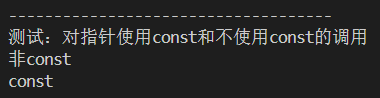

## 8.8 内联函数

### 存在的问题	

​	1、如果函数非常短，编译器处理**实参传送**和**返回结果**而生成的代码的系统开销非常大。

​	2、由于1的极端情况，调用函数的代码占用的内存比函数体的代码还多。

### 处理方法

​	编译器可将函数体中的**实际代码**替换**函数调用**，进行适当调整，处理局部名称。

### 案例

```c++
inline int larger(int m, int n){
    return m > n ? m : n;
}
```

### 后记

​	使用inline关键字是建议编译器用**内联代码**替代**函数调用**，具体执行看编译器。

​	内联函数的定义通常放在头文件中，而不是源文件中。使用内敛函数需要包含该头文件。

​	大多数编译器都把短函数申明为内联函数，即使没有人为使用inline。


## 8.9 函数重载

### 存在的问题

​	1、常常出现两个或多个函数完成相同的任务，但其参数的类型不同。如过去数组中的最大值，

​	对于vector<string>、vector<int>、vector<double>类型。

### 函数签名

​	编译器用函数的签名来区分函数，即函数名和参数列表。注意：返回值不是。

​	因此两个函数不同只需满足下列条件之一：

​	1、函数的参数个数不同

​	2、至少有一对对应参数的类型不同

### 案例

```c++

void sum(int a,int b);
void sum(double a,double c);

int main(){
	int a{1},b{2};
	double c{3.1};
	
	sum(a,b); // 调用sum(int,int);
	//sum(a,c); // 报错，无法确定调用那个函数
	
}
```

### 后记

​	由于存在隐式转换，如存在函数申明：void getInt(int x);，而此时调用getInt(double{3.1});，则会将double转换为int类型。

​	因此，如果存在上述形参列表个数相同，但部分可以进行隐式转换的类型的情况，调用时编译器不支持隐式转换。针对此情况，往往是函数设计的问题，此时应该优化函数的设计。


### 8.9.2 重载和引用参数

#### 存在的问题1

​	如参数的类型是int,则不能重载一个函数，这个函数只将int改为引用类型int&。编译器无法确定调用哪个函数。

#### 案例1	

```C++
void sum(int x);
void sum(int& x);
```

#### 案例2

```C++
double larger(double d1,double d2);
long& larger(long& l1,long& l2);

void test1(){
    int a{1},b{4};
    double c{3.1};
    larger(a,b);
    larger(static_cast<long>(a),static_cast<long>(b));
}

// 结果
// double
// double,因为static_cast<long>(a)作为临时变量传入，而long&不会接受临时变量

// 如果想让long& 接受临时变量,使用const修饰
long& larger(const long& l1,const long& l2);

```

### 8.9.3 重载和const参数

#### 简述

​	const参数和非const的参数的唯一区别：用于引用定义参数和指针参数。

​	由于实参是按值传送。所以在函数定义时，对于类似const int a的类型，编译器会自动去掉const。但在函数定义中这么做具有实际意义，防止出现修改实参的操作。

#### 案例

```
//声明中不带有const
long larger(long a, long b);

// 定义中使用const修饰
long larger(const long a, const long b){
	// a = 1l;// 该操作不能出现
	return a > b ? a : b;
}
```

#### 重载和const指针参数

​	实参中对指针类型使用const修饰后，该指针就不能修改地址的值了。针对这种差异，编译器可以识别const和非const声明的差异。

##### 案例

```C++
// 1、重载和const指针参数
long* longer3_1_1(long* a, long* b);
const long* longer3_1_2(const long* a, const long* b);

long* longer3_1_1(long* a, long* b){
    cout << "非const" << endl;
    return *a > *b ? a : b;
}
// 返回值如何不是const，无法和声明匹配。返回值必须是const修饰，因为a，b是const修饰的
const long* longer3_1_2(const long* a, const long* b){
    cout << "const" << endl;
    return *a > *b ? a : b;
}
void test3(){
    long num = 3l;
    long *a{&num}, *b{&num};
    longer3_1_1(a,b);

    const long *c{&num}, *d{&num};
    longer3_1_2(c,d);
}

// 结果为下图
```



##### 后记

​	对于指针类型，可以使用const来区分函数申明。

​	当函数重载出现，仅含有const指针差异时有以下结论(void f(int\*); 和 void f(const int*))：

- **cosnt data_type* 和 data_type* 不是一种类型，即看作int和double的差别，传参时会明确区分。**

- 编译器不会将const的指针的变量传送给非const指针实参。非函数重载的情况也适用。
- 编译器不会将非const指针的变量传送给const指针。仅在当前函数重载的情况下适用。


#### 8.9.4重载和const引用参数

##### 案例

```C++
// 重载和const引用参数
long& larger3_2_1(long& a, long& b){
    cout << "重载：非const引用" << endl;
    return a > b ? a : b;
}
long larger3_2_1(const long& a, const long& b){
    cout<< "重载：const引用" << endl;
    return a > b ? a : b;
}

// 上述是重载const引用和非const引用，下面只有const引用，接受非const和const变量
long larger3_2_2(const long& a, const long& b){
    cout<< "未重载：只有const引用参数" << endl;
    return a > b ? a : b;
}

// 不能使用申明无const、定义有const
long larger3_2_4(long& a, long& b);
long larger3_2_4(const long& a, const long& b){
    cout << "非const引用的函数申明，const引用的函数定义" << endl;
    return a > b ? a : b;
}


void test4(){
    long num = 3l;
    long a{num}, b{num};
    // 对于重载，非const和const引用，调用各自类型
    larger3_2_1(a,b);

    const long c{num}, d{num};
    larger3_2_1(c,d);

    // 未重载，全部接受
    larger3_2_2(a,b);
    larger3_2_2(c,d);
}
// 结果如下图
```


##### 后记

​	对于引用类型，可以使用const来区分函数申明。

​	当重载发生时，有以下结论：

- 参数为非const引用，则只接受非const引用的变量作为实参。未重载情况也适用。
- 参数为const引用，则只接受const引用的变量作为实参。重载时只接受const实参，未重载可以接受非const实参。


